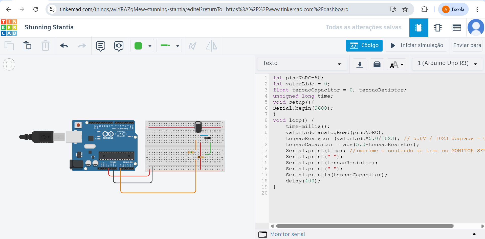
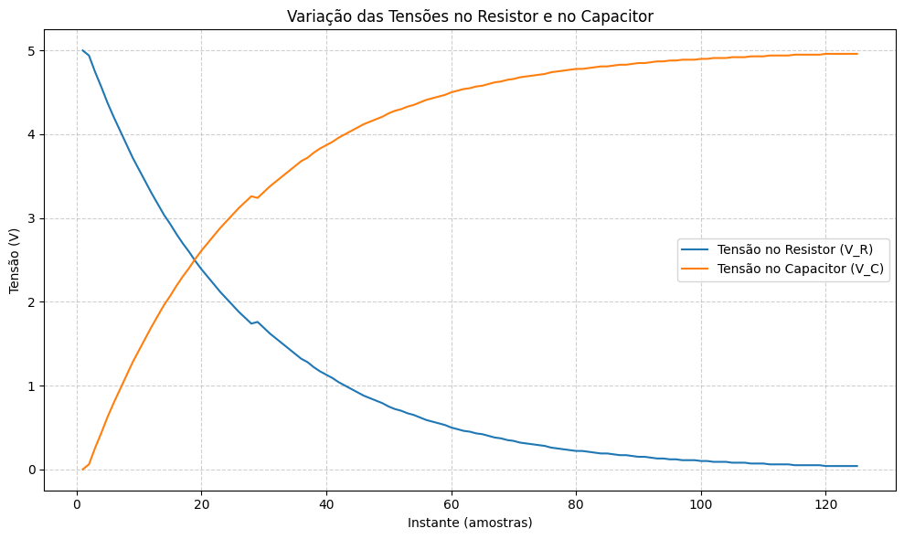

# M04-S02-Comp-ponderada2

# Circuito RC - Análise de Tensão

Este projeto implementa um circuito RC (Resistor-Capacitor) utilizando Arduino para análise do comportamento das tensões no resistor e capacitor ao longo do tempo.

## Descrição

O circuito RC é composto por um resistor e um capacitor em série. O projeto monitora e registra as tensões em ambos os componentes, permitindo visualizar o processo de carga e descarga do capacitor.

## Componentes Necessários

- 1x Arduino UNO
- 1x Resistor (recomendado 10kΩ)
- 1x Capacitor (recomendado 470μF)
- Jumpers
- Protoboard

## Montagem do Circuito

1. Conecte um terminal do resistor ao pino 5V do Arduino
2. Conecte o outro terminal do resistor ao pino analógico A0
3. Conecte um terminal do capacitor ao pino A0
4. Conecte o outro terminal do capacitor ao GND do Arduino

## Código

O código Arduino realiza:
- Leitura da tensão no pino A0
- Cálculo da tensão no resistor e capacitor
- Envio dos dados via porta serial

## Análise dos Dados

Os dados coletados são processados utilizando Python (Jupyter Notebook) para gerar gráficos que mostram:
- Tensão no resistor (V_R)
- Tensão no capacitor (V_C)

### Exemplo de Gráfico Gerado

## Como Utilizar

1. Monte o circuito conforme indicado
2. Carregue o código Arduino (pondAna.ino)
3. Execute o notebook Python (graphs.ipynb) para visualizar os resultados

## Resultados

Os gráficos mostram o comportamento característico de um circuito RC:
- Decaimento exponencial da tensão no resistor
- Carga exponencial do capacitor